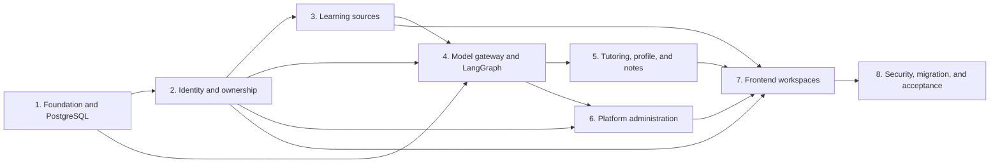

# Adaptive Learning Assistant Implementation Plan

> **For agentic workers:** REQUIRED SUB-SKILL: Use superpowers:subagent-driven-development (recommended) or superpowers:executing-plans to implement this plan task-by-task. Steps use checkbox (`- [ ]`) syntax for tracking.

**Goal:** Deliver a multi-user learning assistant that converts owned articles, EPUBs, and text PDFs into durable, adaptive, evidence-backed learning sessions, with atomic notes and a privacy-preserving platform administration workspace.

**Architecture:** Extend the existing NestJS/Vue modular monolith. Prisma/PostgreSQL remains the sole business source of truth; BullMQ owns asynchronous ingestion and cleanup; LangGraph owns only resumable tutoring execution and uses PostgreSQL checkpoints keyed to domain session IDs; LangChain supplies OpenAI-compatible model adapters and Zod-validated structured output. Deliver the change as eight independently testable slices so authentication and ownership land before any user content or AI execution.

**Tech Stack:** NestJS 11, Prisma 6/PostgreSQL, BullMQ/Redis, LangGraph JS, LangChain JS, Zod, Argon2id, JWT, SMTP, S3-compatible object storage, Vue 3, Pinia, Vue Router, Element Plus, Vitest, Vue Test Utils, Playwright-compatible browser acceptance.

---

## Source of truth

- Product and acceptance baseline: `docs/design.md`
- Approved visual behavior: `docs/design-prototypes/learning-assistant-v0.html`
- OpenSpec change: `openspec/changes/add-adaptive-learning-assistant/`
- OpenSpec task inventory: `openspec/changes/add-adaptive-learning-assistant/tasks.md`
- This document: delivery order, dependencies, cross-slice quality gates, and execution index
- Slice plans: exact files, 2–5 minute TDD actions, commands, expected outcomes, and commit boundaries

If this plan conflicts with a scenario in `specs/*/spec.md`, the scenario wins and the plan must be corrected before implementation continues.

## Delivery dependency graph



## Locked implementation boundaries

| Boundary | Owns | Must not own |
|---|---|---|
| Prisma domain services | users, ownership, sources, contracts, turns, evidence, mastery, profiles, notes, quotas, audit | transient graph cursor |
| LangGraph | node cursor, pending interrupt, bounded structured node state | permissions, mastery truth, notes, quota truth |
| ModelGateway | model selection, Prompt version, structured validation, retry/fallback, usage records | domain writes or authorization |
| BullMQ | file parsing, content map generation, cleanup, large exports | interactive tutoring turns |
| Web authentication | short-lived access JWT plus rotating hashed refresh cookie | extension capture credentials |
| Extension token | one-time raw token, stored hash, `capture:create` scope | learning reads or admin access |
| Administration API | sanitized metadata and protected operations | source bodies, answers, note bodies, hidden prompts, Graph State |

## Global implementation rules

- Every domain query receives trusted `userId` from an auth guard; never accept ownership from request bodies or model output.
- Every AI response crosses a Zod schema and source-anchor validator before a domain write.
- Every retried command carries an idempotency key and either reuses the existing record or returns its committed result.
- Every protected administration mutation records both successful and rejected attempts with a reason and correlation ID.
- Access tokens live in Pinia memory. Refresh tokens are `HttpOnly`, `Secure` in production, `SameSite=Lax` cookies. The client uses a single-flight refresh interceptor.
- Raw passwords, refresh tokens, API tokens, provider secrets, source bodies, answers, notes, prompts, and Graph State never enter logs, job metadata, audit metadata, or administration DTOs.
- Do not add a vector database, multi-agent runtime, OCR, external search, or a separate top-level “学习助手管理” menu.

## Locked cross-slice TypeScript contracts

These names and shapes are shared by later slices. Change them only by updating every dependent slice and its tests in the same plan revision.

```ts
export type Role = 'USER' | 'ADMIN';

export type AuthPrincipal =
  | { kind: 'web'; userId: string; role: Role; sessionId: string }
  | { kind: 'api-token'; userId: string; role: Role; tokenId: string; scopes: string[] };

export type ModelPurpose =
  | 'CONTENT_MAP'
  | 'TUTOR_ACTION'
  | 'ANSWER_EVALUATION'
  | 'NOTE_DRAFT'
  | 'LINK_SUGGESTION'
  | 'CONNECTION_TEST';

export interface StructuredModelRequest {
  userId: string;
  purpose: ModelPurpose;
  modelProfileVersionId: string;
  promptVersionId: string;
  messages: Array<{ role: 'system' | 'user' | 'assistant'; content: string }>;
  correlationId: string;
}

export interface ModelGateway {
  invokeStructured<T>(request: StructuredModelRequest, schema: import('zod').ZodType<T>): Promise<T>;
}

export interface RetryPolicy {
  idempotent: boolean;
  automaticAttempts: number;
  unrecoverableCodes: string[];
}

export interface TutoringGraphState {
  userId: string;
  sessionId: string;
  projectId: string;
  sourceVersionId: string;
  currentUnitId: string;
  currentTurnId?: string;
  idempotencyKey?: string;
  pendingInteraction?: unknown;
}
```

`TutoringGraphState.userId` is copied from the trusted domain session when invocation starts and is never used as an authorization source. Nodes re-read the owned domain session before every write.

## Slice index

### Slice 1: Foundation and PostgreSQL

Plan: [plans/01-foundation-postgresql.md](plans/01-foundation-postgresql.md)

Delivers a green baseline, pinned dependencies, validated configuration, PostgreSQL/Redis/object-storage/mail containers, the complete indexed Prisma schema, and a rehearsable SQLite import path. Covers OpenSpec tasks 1.1–2.8.

### Slice 2: Identity, ownership, and extension tokens

Plan: [plans/02-identity-ownership.md](plans/02-identity-ownership.md)

Delivers email account lifecycle, rotating Web sessions, RBAC, owner-scoped repositories, last-admin protection, and one-time user-scoped extension capture tokens. Covers tasks 3.1–4.6 and the auth portions of 12.1–12.5.

### Slice 3: Learning source ingestion and contracts

Plan: [plans/03-learning-sources.md](plans/03-learning-sources.md)

Delivers object storage, immutable source versions, secure EPUB/PDF ingestion, Web-capture migration, parsing stages, stable anchors, content maps, user-confirmed units, and learning contracts. Covers tasks 5.1–6.6.

### Slice 4: ModelGateway and durable LangGraph

Plan: [plans/04-model-gateway-langgraph.md](plans/04-model-gateway-langgraph.md)

Delivers encrypted providers, immutable model/Prompt versions, quotas, structured model calls, grounded action/evaluation contracts, PostgreSQL checkpointing, and the initial resumable graph. Covers tasks 7.1–7.7 plus model quota foundations from 11.4–11.5.

### Slice 5: Adaptive tutoring, profile, and atomic notes

Plan: [plans/05-learning-runtime.md](plans/05-learning-runtime.md)

Delivers authenticated tutoring sessions, SSE, evidence-gated mastery, completion reports, evidence-backed learner strategies, user controls, confirmed atomic notes, linking, and export. Covers tasks 8.1–10.6.

### Slice 6: Platform administration backend

Plan: [plans/06-platform-administration.md](plans/06-platform-administration.md)

Delivers users, tools, learning-assistant module settings, model services, quotas, jobs, health, and immutable audit APIs with strict content privacy. Covers tasks 11.1–11.9 and the server-side portions of modified `platform` requirements.

### Slice 7: Frontend user and administration workspaces

Plan: [plans/07-frontend-workspaces.md](plans/07-frontend-workspaces.md)

Delivers the approved authentication, learning, settings, notes, profile, and `/admin` screens with role-aware navigation, recoverable states, and component tests. Covers tasks 12.1–14.8.

### Slice 8: Security, migration, observability, and acceptance

Plan: [plans/08-quality-and-release.md](plans/08-quality-and-release.md)

Delivers correlation, rate limits, prompt-injection and deletion suites, evaluation calibration, migration rehearsal, full acceptance, documentation, and rollback evidence. Covers tasks 15.1–15.9 and closes all cross-cutting scenarios.

## Required verification after every slice

Run from `D:\Work\super-admin`:

```powershell
pnpm --filter server test -- --runInBand
pnpm --filter server build
pnpm --filter client test -- --run
pnpm --filter client build
```

Expected: all configured suites pass and both builds exit `0`. Before Slice 7 adds the client test runner, replace the client test command with `pnpm --filter client build` and record that exception in the slice evidence.

For schema-changing slices also run:

```powershell
pnpm --filter server exec prisma validate
pnpm --filter server exec prisma generate
```

Expected: `The schema ... is valid` and Prisma Client generation exits `0`.

## OpenSpec coverage checkpoint

| OpenSpec group | Owning slice |
|---|---|
| 1. Baseline and Dependencies | 1 |
| 2. PostgreSQL Schema and Migration | 1, final rehearsal in 8 |
| 3. Authentication and Ownership | 2 |
| 4. User-Scoped Extension Tokens | 2 |
| 5. Learning Source Ingestion | 3 |
| 6. Content Map and Learning Contract | 3 |
| 7. Model Gateway and LangGraph Foundation | 4 |
| 8. Adaptive Tutoring Runtime | 5 |
| 9. Learner Profile | 5 |
| 10. Atomic Notes and Export | 5 |
| 11. Platform Administration Backend | 4 and 6 |
| 12. Frontend Authentication and Navigation | 2 and 7 |
| 13. Learning Workspace Frontend | 7 |
| 14. Administration Workspace Frontend | 7 |
| 15. Security, Observability, and Quality Gates | 8 |

## Final definition of done

- Every checkbox in the eight slice plans is complete and each slice has a green verification commit.
- All 56 OpenSpec requirements and 133 scenarios have a named automated test or a documented browser acceptance check.
- `npx --yes @fission-ai/openspec@latest validate add-adaptive-learning-assistant --strict --json` returns `valid: true` with zero issues.
- Cross-user IDOR, ordinary-user `/api/admin/*`, raw secret exposure, invalid source anchors, duplicated turn submission, and retry of unsafe jobs are all rejected by tests.
- Refresh/restart resumes the same tutoring interrupt without duplicating turns or evidence.
- Only validated transfer evidence can produce `TRANSFER_VALIDATED` mastery.
- The sidebar contains “学习助手” for authenticated users and “后台管理” only for administrators; there is no top-level “学习助手管理”.
- Administrator responses and rendered pages contain no protected learning-content fields.
- Migration rehearsal preserves counts, content hashes, job associations, and a tested restore path.
- `docs/design.md`, OpenSpec artifacts, deployment docs, admin docs, extension docs, and privacy docs agree with the shipped behavior.
